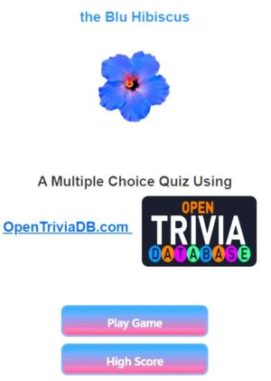

# bluHibiscus_quizApp

A quiz application that uses the opentdb quiz api to generate multiple choice questions and answers.

[A deployed version can be viewed here.](https://blunite.github.io/bluHibiscus_quizApp/)

---

## Contents

- [bluHibiscus_quizApp](#bluhibiscus_quizapp)
  - [Contents](#contents)
  - [About](#about)
  - [User Story](#user-story)
  - [Acceptance Criteria](#acceptance-criteria)
  - [Visuals:](#visuals)
  - [Installation:](#installation)
  - [License](#license)
  - [Contributing:](#contributing)
  - [Tests:](#tests)
  - [Authors and Acknowledgments](#authors-and-acknowledgments)
  - [Contact Information:](#contact-information)

---

## About

The quiz application is timed and presents the user with random multiple choice questions and answers. A response of "Correct" or "Incorrect" is thrown with alerts and a change in the choice background to reflect the users answer choice. High scores rated can be tracked after the user enters a name. Scores are tracked using local storage web api.

---

## User Story

As a coding boot camp student
I WANT to take a quiz that is timed using javaScript fundamentals that store high scores,
so that I can track my progress and compare results to peers

---

## Acceptance Criteria

Given I am using a code quiz app
WHEN I click the start button
Then a timer starts and I am given a set of questions and choices
WHEN I answer a question
THEN another question is shown
When I choose the wrong answer
THEN time is taken subtracted from timer/clock
WHEN questions answered is complete or timer is 0
THEN the game is over
WHEN the game is over
THEN I can save my player name and my score

---

## Visuals:

---

## Installation:

Go to GitHub.com and navigate to the main page of the repository. Then, click <> CODE, above the list of list of files. Then, copy the URL for the repository. Click the applicable clipboard for, HTTPS, SSH, or GitHub CLI. THEN, open Git Bash, and change the current working directory to the location where you want the cloned directory. THEN, type [git clone]. Then, paste the URL you copied [git clone https://github.com/YOUR-USERNAME/YOUR-REPOSITORY]. THEN, press enter to create your local clone.

To clone the repo:

      git clone https://github.com/BluNite/bluHibiscus_quizApp.git

---

## License

License used for this project - MIT

- For more information on license types, please reference this website
  for additional licensing information - [https: //choosealicense.com/](https://choosealicense.com/).

---

## Contributing:

To contribute to this application, create a pull request.
Here are the steps needed for doing that:

- Fork the repo
- Create a feature branch (git checkout -b NAME-HERE)
- Commit your new feature (git commit -m 'Add some feature')
- Push your branch (git push)
- Create a new Pull Request

Following a code review, your feature will be merged.

---

## Tests:

---
---
## Challenges and Issues:

atob() for encoding to html  will eliminate symbols, and spinner is needed for api load time and blank space when loading to html

---

## Authors and Acknowledgments

Nkenge Crowe (bluNite)

James Quick https://github.com/jamesqquick
Build a Quiz App https://github.com/jamesqquick/Build-A-Quiz-App-With-HTML-CSS-and-JavaScript
GitHub.com open source quiz projects (open-source examples of quiz applications)

---

## Contact Information:

- GitHub Username: BluNite
- GitHub Email: ncrowe175@gmail.com
